# A ColdFusion custom tag to improve the native cfdump tag

The `<cfdump>` tag is very handy to debug data. However, the output of it, especially in Adobe ColdFusion, unfortunately is very sparse. And while Lucee does way better here, there is still room for improvement. This custom tag `<cf_dump>` is written from scratch, offers more insight and usually renders faster than the native (ACF) cfdump.

Anyway, pictures are worth a thousand words:

## empty string

Hints the number of characters (`len`).

| cf_dump | Adobe CF | Lucee |
| ------- | -------- | ----- |
|  |  |  |

## string

| cf_dump | Adobe CF | Lucee |
| ------- | -------- | ----- |
|  | 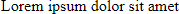 |  |

## string with preserved whitespaces

Preserve whitespaces with the `pre` attribute: `<cf_dump pre var="#str#">`

| cf_dump | Adobe CF | Lucee |
| ------- | -------- | ----- |
| 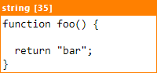 | 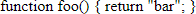 |  |

## string with leading/trailing whitespaces

Whitespaces in strings can be such a pain, as you cannot spot them with a regular dump. `cf_dump` indicates such an occurence. Note: You can disable the indication, if you don't need it, see Attributes section.

_(Strings starts with a tab character and ends with two spaces.)_

| cf_dump | Adobe CF | Lucee |
| ------- | -------- | ----- |
|  | 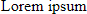 |  |

## empty struct

Hints the key count (`structCount`) and the type of the `Map` implementation.

| cf_dump | Adobe CF | Lucee |
| ------- | -------- | ----- |
| 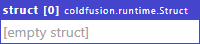 |  |  |

## struct

| cf_dump | Adobe CF | Lucee |
| ------- | -------- | ----- |
| 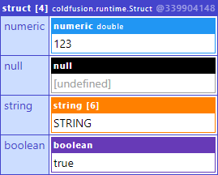 |  | 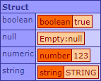 |

## empty array

Hints the size (`arrayLen`) and type of the `List` implementation.

| cf_dump | Adobe CF | Lucee |
| ------- | -------- | ----- |
|  |  |  |

## array

| cf_dump | Adobe CF | Lucee |
| ------- | -------- | ----- |
| 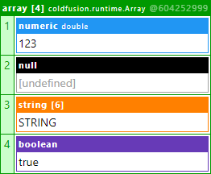 | 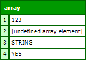 | 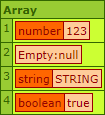 |

## empty query

Hints the number of rows (`recordCount`).

| cf_dump | Adobe CF | Lucee |
| ------- | -------- | ----- |
|  |  | 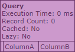 |

## query

| cf_dump | Adobe CF | Lucee |
| ------- | -------- | ----- |
| 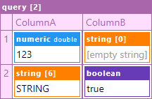 | 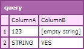 | 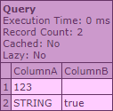 |

## xml

| cf_dump | Adobe CF | Lucee |
| ------- | -------- | ----- |
| 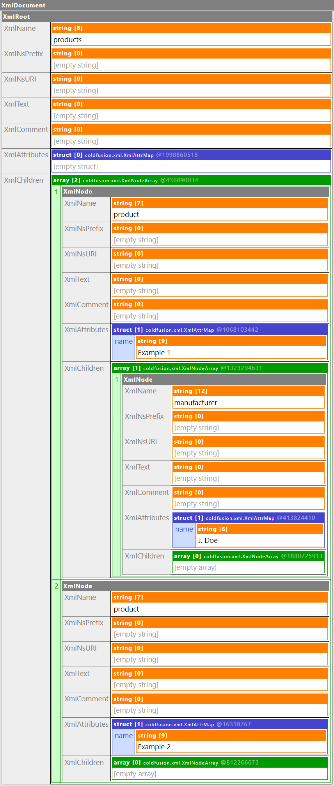 | 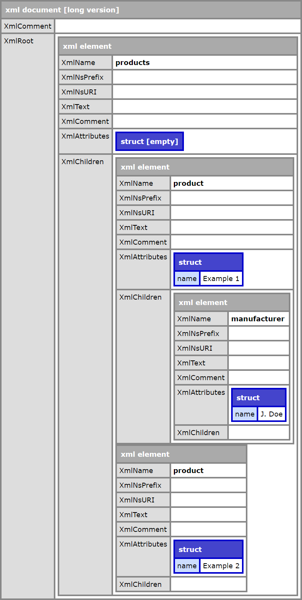 | 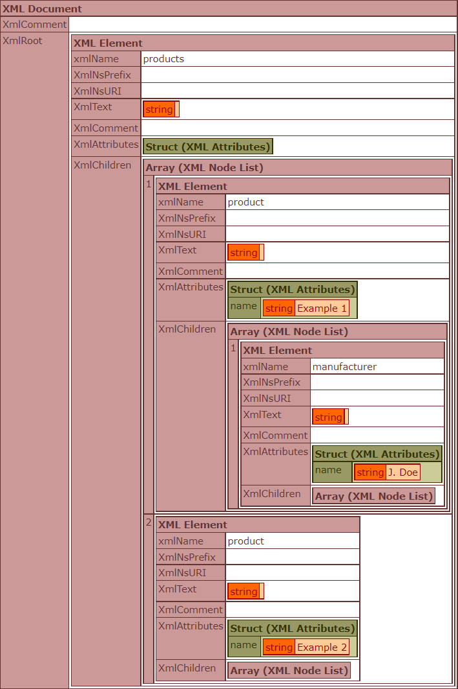 |

## exception

| cf_dump | Adobe CF |
| ------- | -------- |
| 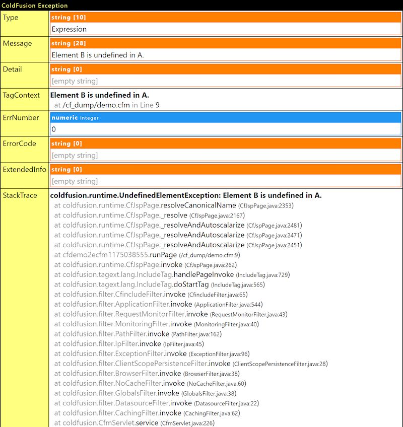 | 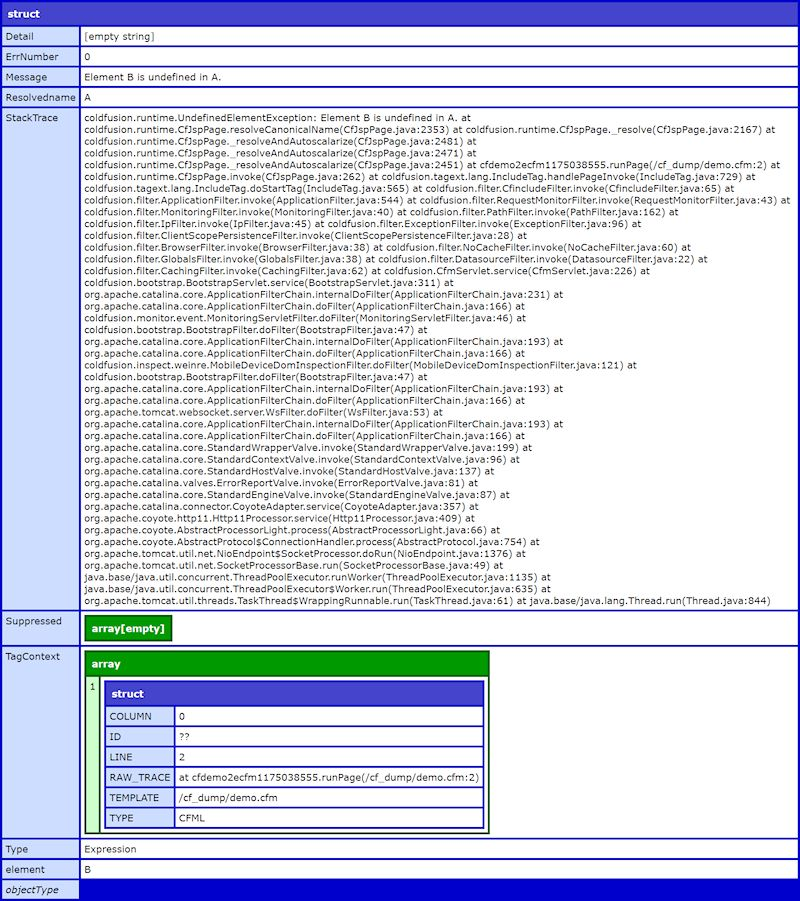 |

| cf_dump | Lucee |
| ------- | ----- |
| 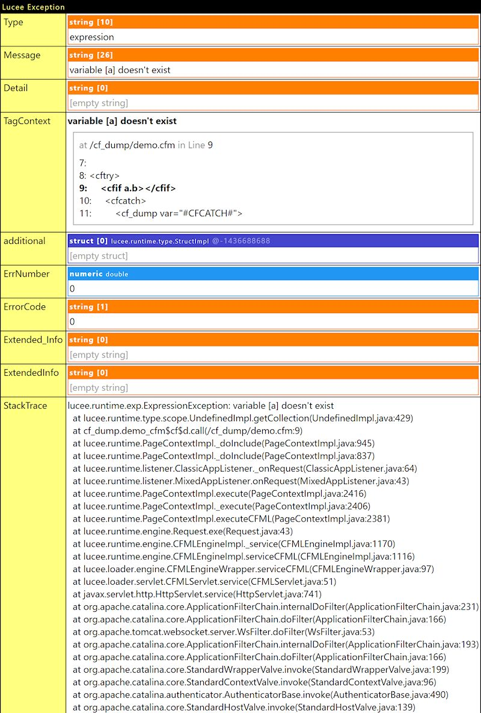 | 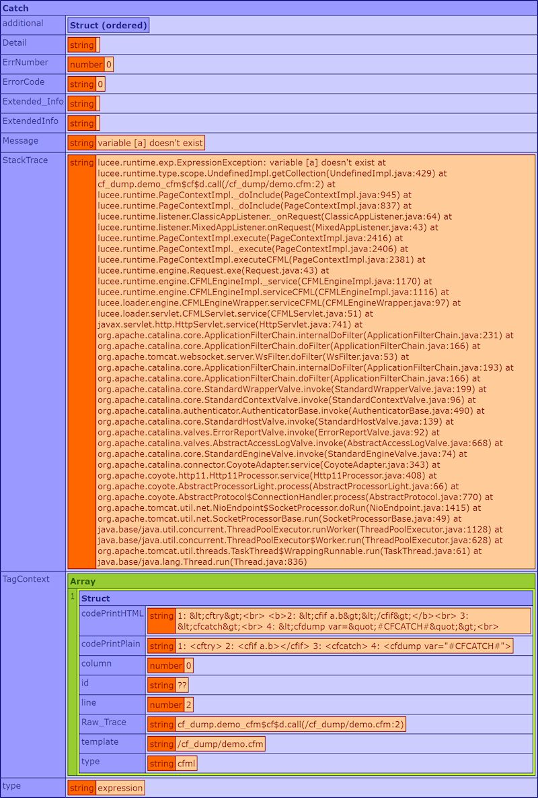 |

## component with public fields

| cf_dump | Adobe CF | Lucee |
| ------- | -------- | ----- |
|  | 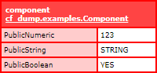 | 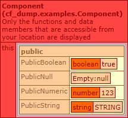 |

## component with private fields

To expose private variables of a component (everything inside of the `VARIABLES` scope), just implement a function called `dump` and let it return `VARIABLES`. The custom tag will invoke this method automatically and include the struct in the dump with the special indicator `👁`.

| cf_dump | Adobe CF | Lucee |
| ------- | -------- | ----- |
| 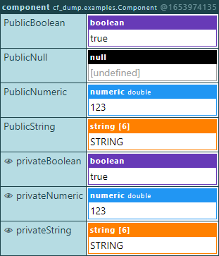 | 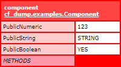 | 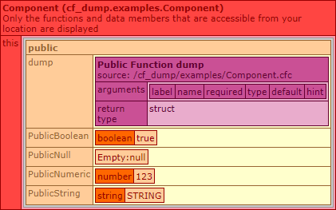 |

<details>
	<summary>How to implement dump()</summary>

script syntax
```cfml
component {

	public struct function dump() {

		return VARIABLES;
	}

}
```

tag syntax
```cfml
<cfcomponent>

	<cffunction accessor="public" returnType="struct" name="dump">

		<cfreturn VARIABLES>
	</cffunction>

</cfcomponent>
```

</details>

## Java object

| cf_dump | Adobe CF | Lucee |
| ------- | -------- | ----- |
| 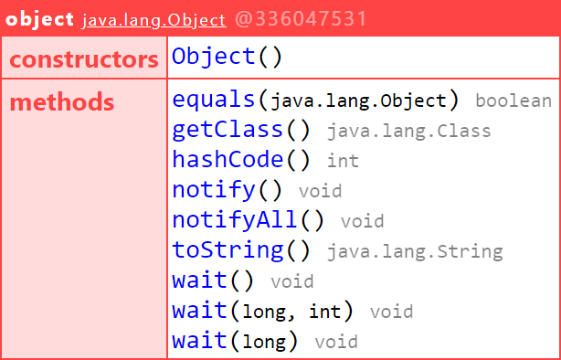 | 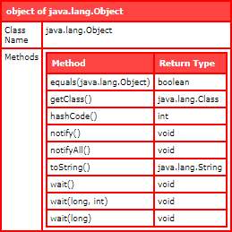 | 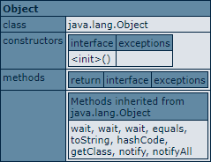 |

## Byte array with encoding

The native dump tag represents a Byte as signed number (Java default). I rarely find this helpful, so I decided to represent each Byte as hex in an actual array.

| cf_dump | Adobe CF | Lucee |
| ------- | -------- | ----- |
| 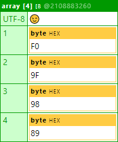 | 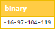 | 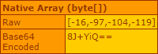 |

It also offers a preview of the encoded string. You can specify the desired encoding(s), see Attributes section.

## Blacklisting specific keys in structs and fields in components

When dumping deeply nested data structures, you may want to skip specific fields to keep it small. `<cf_dump>` offers this kind of blacklisting.

<details>
	<summary>Show code</summary>

```cfml
<cfset data = {
	A: "A",
	B: [],
	C: {
		A: "C.A",
		B: "C.B"
	},
	D: [
		{ A: "D.A" },
		{ B: "D.A" }
	],
	E: "E"
}>

<cf_dump blacklist="B,E" var="#data#">
```

</details>

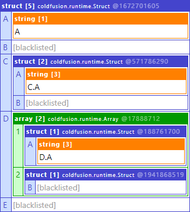

## Circular references

To prevent recursively dumping circular references, all complex values are only dumped once while subsequent dumps will just point to the object's hashCode.

<details>
	<summary>Show code</summary>

```cfml
<cfset X   = {}>
<cfset Y   = {}>
<cfset X.Y = Y>
<cfset Y.X = X>

<cf_dump var="#X#">
<cf_dump var="#Y#">
```

</details>

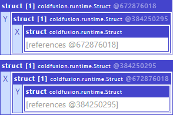

## Expand/Collapse by clicking on the column and row headers

Just like the native cfdump tag, you can click on column and row headers to expand/collapse its values. The required JavaScript will be included once, regardless of how many dumps you do on a single page to keep the response as small as possible. This also applies to styles.

## Optional Tag Attributes

### var

The variable or expression to dump, just like the native cfdump tag. If you omit this attribute, `null` will be dumped.

### label

A label to be displayed on top of the dump, making it easier to identify multiple dumps.

<details>
	<summary>Show code</summary>

```cfml
<cf_dump label="This is Label 1" var="#{}#">
<cf_dump label="This is Label 2" var="#{}#">
```

</details>

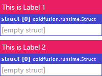

### top

Limit the number of keys and rows to display. This is handy if you have large data amounts and want to reduce the time it takes to render them. Default: `-1`

<details>
	<summary>Show code</summary>

```cfml
<cfset data = {
	"array": [ 1, 2, 3, 4 ],
	"level1": {
		"level2": {
			"level3": {
				"level4: {}
			}
		}
	}
}>

<cf_dump top="2" var="#data#">
```

</details>

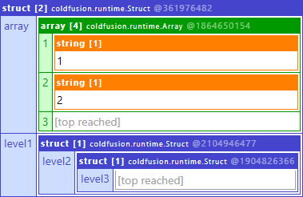

### pre

Preserve whitespaces in strings when displaying the dump. Default: `false`

### wsWarning

Show warning if strings contain leading or trailing whitespaces. Default: `true`

### blacklist

Keys to blacklist. Blacklisted keys will not be dumped. Default: `[]`

### byteEncoding

Encoding(s) to use when dumping byte arrays. Default: `[ "UTF-8" ]`

### reset

Discard all output before `<cf_dump>` is executed. This is handy if you want to dump in the middle of a view without rendering the view up to this point. Default: `false`

### abort

Abort the request after `<cf_dump>` has been executed. This is a convenience shortcut for `<cfabort>`. Default: `false`

### embed

Embed `<style>` and `<script>` content, required for the visual representation. Specify this when using `<cf_dump>` in a separate output context such as `<cfsavecontent>`. **Note:** When you want to send the dump via mail, you should use `<cf_dumpmail>` instead. Default: `false`

## Overriding tag attribute defaults

You can override the defaults of attributes by setting the corresponding key in the `REQUEST` scope. Of course, you can still override individual attributes per tag.

### Example

```
<cfset REQUEST["__cf_dump_wsWarning"] = false>
```
_(That's **two** underscores `__`, then `cf_dump`, another single underscore `_` and then the name of the attribute.)_

This will disable the whitespace indicator for strings for the rest of the request.

You can override defaults at any point, but I recommend specifying them in the Application.cfc's `onRequestStart` function.

## `cf_dumpmail`

When you want to send a dump via HTML mail, you might encounter a few style related issues that depend on the e-mail client (CSS support). For this reason `<cf_dumpmail>` exists. Here are the differences:

- colors are inlined (for better compatibility)
- `<style>` tag is always present (attribute `embed` always true/doesn't exist)
- `<script>` tag is not present (as e-mail clients do not execute JavaScript anyway)
